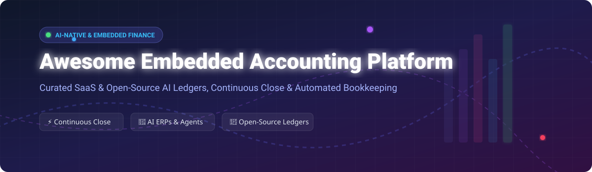

  

# 💼 Awesome Embedded Accounting Platform 🚀

> **Curated Ecosystem of SaaS Products & Open-Source Projects for Embedded Accounting, AI Ledgers, Continuous Close & Automated Bookkeeping** 📊

---

## 📌 Overview & Market Analysis

### 📊 Estimated Sector Market Size & Market Dynamics
> 💡 **Market Size:** The global **Embedded Finance & Embedded Accounting** market is estimated at **$85 Billion+ in 2026** and projected to surpass **$180 Billion by 2030** (CAGR ~24.5%).
>
> 🧩 **Market Fragmentation:** The sector is **highly fragmented**. While legacy accounting software (NetSuite, QuickBooks, SAP) dominated the previous era, the shift toward **AI-native ledgers, autonomous reconciliations, and continuous close** has sparked a wave of specialized category leaders (e.g., ecommerce accounting, venture SaaS ERPs, billing automation, firm workflows). There is currently **no single "winner-take-all" player** in embedded AI accounting.

---

## 📋 Table of Contents

- [🏢 SaaS/Hosted Platforms](#-saashosted-platforms)
- [📂 Open-Source GitHub Projects](#-open-source-github-projects)
- [🤝 How to Contribute](#-how-to-contribute)
- [💖 Support & Sponsorship](#-support--sponsorship)
- [📈 Star History](#-star-history)
- [⚠️ Disclaimer](#%EF%B8%8F-disclaimer)

---

## 🏢 SaaS/Hosted Platforms

The following SaaS platforms provide embedded accounting, automated GL operations, continuous close, and revenue recognition.

*Sorted by Valuation / Estimated Scale (Descending)* ⬇️

| Platform 🏢 | Valuation / Scale / Funding 💰 | Pricing Model 🏷️ | Free Tier / Free Trial Limits 🎁 | Primary Focus & Description ⚡ |
| :--- | :--- | :--- | :--- | :--- |
| **[Rillet](https://www.rillet.com/)** | **$1.0 Billion** (Valuation, 2026) / ~$6.8M ARR | Quote-based; observed median contract **$20,100–$34,800/yr** (No per-seat fee) | **No Free Tier / No Free Trial** (Sales demo required) | AI-native ERP replacing traditional GL for scaling SaaS companies with continuous close and autonomous Aura AI journal entries. |
| **[Campfire](https://campfire.ai/)** | **$103.5M+ Funding** (Series B, 2025) / 10x ARR growth | Quote-based custom enterprise pricing | **No Free Tier / No Free Trial** (Guided product demo required) | AI-native ERP built on proprietary Large Accounting Model (LAM) for venture-backed startups and mid-market scaling teams. |
| **[Botkeeper](https://www.botkeeper.com/)** | **$105.0M** (Historical Valuation) / $89.5M Funding | Historical: **$69/entity license fee** or $1,500–$3,000+/mo | **No Free Tier** (Custom pilot programs for accounting firms) | AI & human-assisted bookkeeping automation for accounting firms *(Note: Ceased standalone ops in early 2026)*. |
| **[Numeric](https://www.numeric.io/)** | **$89.0M Funding** (Series B, 2025) / ~$7.8M ARR | Essentials plan starts at **$30/user/mo**; custom quote for ERP sync | **No Free Tier** (Assessed sales demo available) | AI-first month-end close automation, automated reconciliations, and flux analysis on top of NetSuite/QuickBooks. |
| **[Puzzle](https://puzzlehq.com/)** | **$66.5M Funding** / ~$52M+ Valuation | Starter plan starts at **$30/mo** (Core $72/mo, Complete $120/mo) | **14-Day Free Trial** (Full access to Starter/Core features) | AI-native accounting platform and real-time ledger built specifically for venture-backed startups and SMBs. |
| **[Sequence](https://www.sequencehq.com/)** | **$19.0M Funding** (a16z backed) | Growth Plan published at **$799/mo** (<$1M ARR); custom for Enterprise | **No Free Tier** (Provides isolated Sandbox environment & live demo) | Billing & revenue automation platform handling CPQ, ASC 606 revenue recognition, and subscription invoicing. |
| **[Truewind](https://www.truewind.ai/)** | **$17.0M Funding** (Series A, YC backed) | Custom pricing tailored to transaction volume (~**$500–$1,500/mo** estimated) | **No Free Trial** (Guided onboarding demo required) | AI accounting automation focused on review-ready preparation, source-linked workpapers, and exception-first audit trails. |
| **[Finaloop](https://www.finaloop.com/)** | **$140.0M** (Valuation, 2024) / ~$10M–$16M ARR | Starter Plan starts at **$245/mo** (for brands <$1M gross revenue) | **14-Day Free Trial** (Includes 2 previous months of historical accounting free) | AI-powered real-time bookkeeping and inventory accounting platform custom-built for ecommerce & DTC brands. |
| **[Digits](https://digits.com/)** | Venture-backed / $35M+ Funding | **$65–$250/mo** per business; $35/client/mo for accounting firms | **30-Day Free Trial** (Full platform access with live bank feeds) | Financial intelligence platform with automated bookkeeping, conversational AI ("Ask Digits"), and outcome-based firm pricing. |
| **[Booke AI](https://booke.ai/)** | Seed-backed / Early stage | Data Entry Hub starts at **$20/client/mo** ($129/mo for single business) | **14-Day Free Trial** (No credit card required for trial) | AI Bookkeeper extension working inside QuickBooks Online and Xero for automatic OCR extraction, matching, and reconciliation. |

---

## 📂 Open-Source GitHub Projects

Self-hosted engines, double-entry accounting libraries, plain-text accounting tools, and AI accounting agents for developer-led teams.

*Sorted by GitHub Stars_Count (Descending)* ⬇️

| Project 🛠️ | GitHub Stars_Count ⭐ | Description & Key Capabilities ⚡ | License 📜 |
| :--- | :--- | :--- | :--- |
| **[Firefly III](https://github.com/firefly-iii/firefly-iii)** |  | Self-hosted personal and small-business financial manager with full double-entry support, recurring transactions, and API integrations. | AGPL-3.0 |
| **[TaxHacker](https://github.com/vas3k/TaxHacker)** |  | Self-hosted AI accounting app with LLM document extraction for receipts and invoices. Supports local OpenAI-compatible endpoints. | MIT |
| **[Beancount](https://github.com/beancount/beancount)** |  | Double-entry accounting tool that uses plain text files as storage. Flexible command-line toolchain for financial modeling. | GPL-2.0 |
| **[Kill Bill](https://github.com/killbill/killbill)** |  | Open-source subscription billing and payment platform for enterprise scale with complex ledger integration. | Apache-2.0 |
| **[GnuCash](https://github.com/gnucash/gnucash)** |  | Modern desktop personal and small-business financial-accounting software with double-entry, bank reconciliations, and reporting. | GPL-2.0+ |
| **[Fava](https://github.com/beancount/fava)** |  | Web interface for the Beancount plain-text accounting system, providing rich reports, charts, and transaction editing. | MIT |
| **[Django Ledger](https://github.com/arrobalytics/django-ledger)** |  | Double-entry accounting engine built on Django. Features chart of accounts, financial statements, purchase/sales orders, and OFX import. | MIT |
| **[ERPClaw](https://github.com/avansaber/erpclaw)** |  | AI-native ERP operated via plain language. Generates balanced journal entries, ASC 606 revenue recognition, and intercompany ledger. | GPL-3.0 |
| **[Ganzabara](https://github.com/Vahrka/Ganzabara)** |  | Free open-source PySide6 accounting software for SMBs with double-entry bookkeeping, VAT/GST calculations, and OCR scanning. | Custom Non-SaaS |
| **[BrassLedger](https://github.com/rhamenator/BrassLedger)** |  | Cross-platform .NET business management and general ledger system for receivables, payables, payroll, and tax workflows. | GPL-3.0 |
| **[CFO Stack](https://github.com/MikeChongCan/cfo-stack)** |  | AI agent skills (Claude Code, Gemini) built on top of Beancount & Fava for automated document logging and transaction extraction. | MIT |

---

## 🤝 How to Contribute

Contributions are highly encouraged! To add or update entries:

1. 🍴 **Fork the repo**.
2. 📝 **Add/edit entries in `README.md`** following the tabular format.
3. 🔍 **Ensure specific data**: Include specific starting pricing, explicit free trial terms, and scale/star metrics.
4. 🚀 **Submit a Pull Request** with a concise description of your additions.

---

## 💖 Support & Sponsorship

If you find this curated list helpful for building embedded finance solutions or evaluating AI accounting tools, please consider supporting the project:

- ⭐ **Star this repository** to help others discover it!
- 🔀 **Fork & Share** with fellow developers and finance builders.
- ☕ **Buy me a coffee**: Support ongoing maintenance via the [GitHub Sponsor Dashboard](https://github.com/sponsors/ishandutta2007).

Thank you for being part of the open accounting automation community! ❤️

---

## 📈 Star History

---

## ⚠️ Disclaimer

- This is a **community-curated** list — not exhaustive and not an official financial endorsement.
- Embedded accounting platforms handle sensitive financial data; ensure full compliance with GAAP, IFRS, tax regulations, and data privacy laws.
- Open-source accounting engines provide strong foundations, but complex multi-entity consolidation or ASC 606 revenue recognition may require additional engineering effort compared to commercial SaaS.
